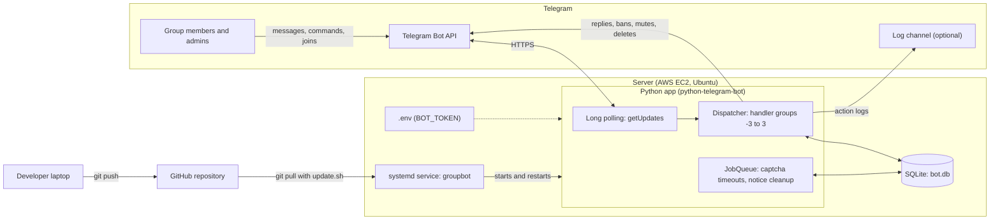
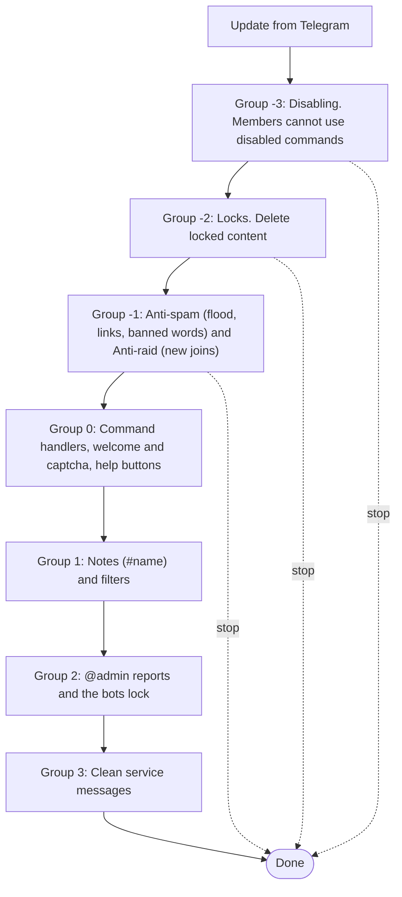
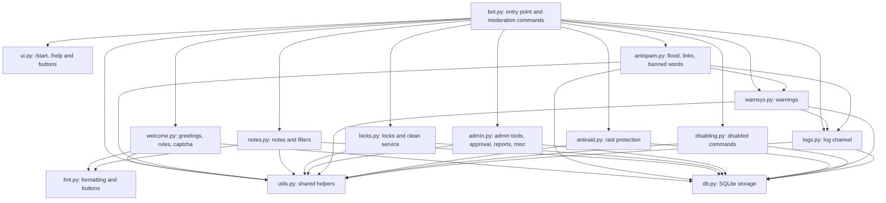
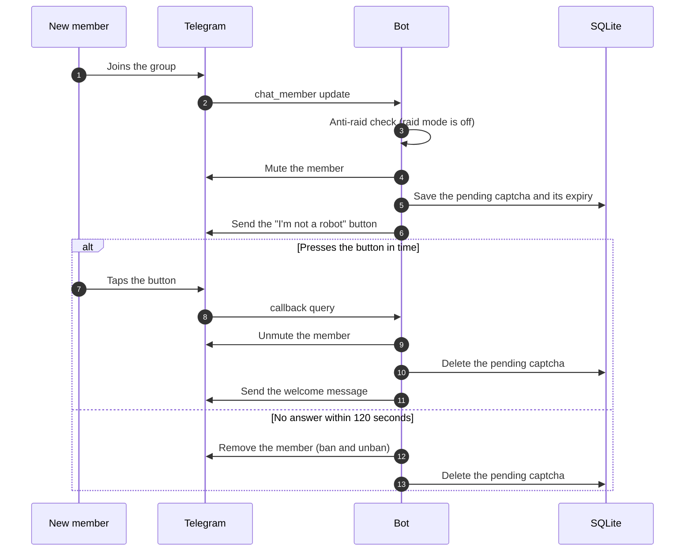
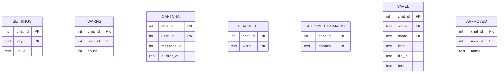
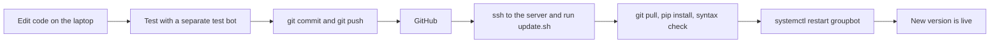

# 🛡️ Telegram Group Manager Bot

A free, self-hosted, all-in-one **Telegram group management bot** written in Python.
Moderation, warnings, welcome messages with captcha, anti-spam, anti-raid, locks, notes, filters, reports, a log channel and more,
with **separate settings for every group** and a friendly button-based help menu.


> **Try it:** add [@VanoxXBot](https://t.me/VanoxXBot) to your group, make it admin and send `/help`.
> **Run your own copy:** see [Run your own copy](#7-run-your-own-copy) and [Deploy 24/7 on AWS](#8-deploy-247-on-aws-ec2).

---

## Table of contents

1. [Features](#1-features)
2. [Architecture](#2-architecture)
3. [Project structure](#3-project-structure)
4. [Using the bot (group admins and members)](#4-using-the-bot)
5. [Command reference](#5-command-reference)
6. [Formatting and buttons](#6-formatting-and-buttons)
7. [Run your own copy](#7-run-your-own-copy)
8. [Deploy 24/7 on AWS EC2](#8-deploy-247-on-aws-ec2)
9. [Operating the bot after deployment](#9-operating-the-bot-after-deployment)
10. [Data and privacy](#10-data-and-privacy)
11. [Troubleshooting](#11-troubleshooting)
12. [Limitations and roadmap](#12-limitations-and-roadmap)
13. [Contributing, license and credits](#13-contributing-license-and-credits)

---

## 1. Features

| Area | What you get |
| --- | --- |
| **Moderation** | `/ban`, `/unban`, `/kick`, `/mute` (with time), `/tban`, `/dban`, `/kickme`, `/purge`, `/del` |
| **Warnings** | `/warn`, `/dwarn`, `/warns`, `/rmwarn`, per-group warn limit and punishment (ban, kick or mute) |
| **Greetings** | Welcome and goodbye messages, group rules, **join captcha** (button) with automatic removal on timeout |
| **Anti-spam** | Flood control, anti-link with an allow-list of domains, banned words. Actions: delete, warn, mute, kick, ban |
| **Anti-raid** | Manual or automatic raid mode: new members are temporarily banned while a raid is going on |
| **Locks** | Delete stickers, GIFs, photos, videos, links, forwards, polls... from regular members, block bots being added, clean service messages |
| **Notes and filters** | Save text or media (with formatting and buttons) and fetch it with `#name`. Auto-replies to keywords |
| **Admin tools** | `/admins`, `/promote`, `/demote`, `/pin`, `/unpin`, `/unpinall` |
| **Approval** | Approved users are ignored by anti-spam, locks and anti-raid |
| **Reports** | Members call the admins with `/report` or `@admin` |
| **Disabling** | Switch member commands off in your group |
| **Log channel** | Copy admin actions to a channel of your choice |
| **Formatting** | Bold, italic, links and inline buttons in welcome messages, rules, notes and filters |
| **Help menu** | `/start` and `/help` with inline buttons, a Close button and 12 help sections |

Everything is stored **per group** in a small SQLite file, so one bot can serve many groups.

---

## 2. Architecture

### 2.1 System overview

The bot uses **long polling**: it connects *out* to Telegram and asks for new updates, so the server needs **no open inbound ports** (other than SSH for you), no domain and no SSL certificate.



### 2.2 How an update is processed

Every update goes through the handler **groups** in order (lowest number first). Inside one group only the first matching handler runs.
A handler can *stop* the whole chain, for example when spam has been deleted, so the removed message never reaches the commands.



### 2.3 Modules



### 2.4 Example: a new member joins (captcha on)



### 2.5 Data model



`SETTINGS` is a key/value table that holds the switches and texts of every feature (for example `welcome_on`, `warn_limit`, `locks`, `log_channel`).
`SAVED` holds both notes (`scope = note`) and filters (`scope = filter`). Its `text` column holds the message template (formatted text and buttons).
Tables are created automatically on start (`CREATE TABLE IF NOT EXISTS`), so updating the bot never needs a manual migration.

### 2.6 Design notes

- **One bot, many groups.** Every setting is keyed by the chat ID.
- **Admins are never punished.** Anti-spam, locks and anti-raid skip admins, anonymous admins, channel posts and approved users. The admin check (an API call) only happens *after* something was detected, which keeps the bot fast.
- **Restart safe.** Warnings, settings, notes and pending captchas live in SQLite. After a restart the captcha timers are re-created. Only short-lived counters (flood counters, join counters) start from zero.
- **Self-cleaning.** Notices posted by the bot delete themselves after a few seconds.
- **Safe replies.** If the command message was deleted before the bot could answer, the bot sends a normal message instead of failing.
- **One running copy per token.** Telegram allows only one polling client per bot token.

---

## 3. Project structure

```text
telegram-group-manager-bot/
├── bot.py           # entry point, moderation commands, builds the application
├── ui.py            # /start, /help, inline buttons, help sections
├── db.py            # SQLite storage (settings, warnings)
├── utils.py         # shared helpers (admin checks, safe replies, target resolving)
├── fmt.py           # formatting engine: entities, markup, buttons, templates
├── welcome.py       # welcome, goodbye, rules, join captcha
├── antispam.py      # flood, anti-link, banned words
├── antiraid.py      # raid mode (manual and automatic)
├── locks.py         # locks and clean service
├── notes.py         # notes and filters
├── admin.py         # admin tools, approval, reports, misc
├── warnsys.py       # warnings with per-group limit and mode
├── disabling.py     # disable/enable member commands
├── logs.py          # log channel
├── requirements.txt # python-telegram-bot[job-queue], python-dotenv
├── .env.example     # configuration template
├── .gitignore       # keeps .env and *.db out of git
├── LICENSE          # Apache-2.0
└── README.md
```

---

## 4. Using the bot

### 4.1 Add the bot to your group

1. Open the bot (for example [@VanoxXBot](https://t.me/VanoxXBot)) and tap **➕ Add me to a Group**, or add it from your group's *Add members* screen.
2. Make the bot an **admin** with these permissions:

| Permission | Needed for |
| --- | --- |
| **Delete messages** | anti-spam, locks, purge, clean service, captcha cleanup |
| **Ban users** (restrict members) | ban, mute, warn punishments, captcha, anti-raid |
| **Pin messages** | `/pin`, `/unpin` |
| **Add new admins** *(optional)* | `/promote`, `/demote` |

3. Use a **supergroup**. Groups that were created as basic groups are upgraded automatically when you turn on some settings (for example by making the chat history visible to new members).

> Bots only receive join and leave events, and see every message, when they are **admins**. That is why the bot must be an admin.

### 4.2 Set up a group in two minutes

Run these in your group as an admin. Everything is optional, pick what you need:

```text
/setrules 1. Be kind  2. No spam
/setwelcome 👋 Welcome *{first}* to {group}! Please read the /rules.
/captcha on
/antilink on
/allowlink youtube.com
/antiflood on
/warnlimit 3
/lock sticker
/setlog
```

Open `/help` in a private chat with the bot for a menu with every section.

### 4.3 For members

| Command | What it does |
| --- | --- |
| `/rules` | show the group rules |
| `#name` or `/get name` | show a saved note |
| `/notes`, `/filters` | list the notes and filters |
| `/report` (reply) or `@admin` | call the admins about a message |
| `/admins` | list the admins |
| `/id`, `/info` | show IDs and user details |
| `/kickme` | remove yourself from the group |
| `/privacy` | what data the bot stores |

---

## 5. Command reference

Most admin commands work on **the user you reply to**, or on a **numeric user ID** (`/ban 123456789`).
Times are written like `10m`, `2h`, `1d`, `1w`.

### Moderation

| Command | Description |
| --- | --- |
| `/ban [reason]` | ban a user |
| `/unban` | remove a ban |
| `/kick` | remove a user (they can join again) |
| `/mute [time] [reason]` | mute a user, permanently if no time is given |
| `/unmute` | remove a mute |
| `/tban [time] [reason]` | temporary ban |
| `/dban` | delete the replied message and ban its sender |

### Warnings

| Command | Description |
| --- | --- |
| `/warn [reason]` | warn a user. At the limit the punishment is applied and the counter resets |
| `/dwarn [reason]` | warn and delete the replied message |
| `/warns` | show a user's warnings |
| `/rmwarn` | remove one warning |
| `/resetwarns` | remove all warnings |
| `/warnlimit [2-10]` | warnings before the punishment (default 3) |
| `/warnmode [ban/kick/mute]` | the punishment (default ban) |

### Welcome, goodbye, rules and captcha

| Command | Description |
| --- | --- |
| `/welcome on/off` | welcome message on or off (default on) |
| `/setwelcome [text]` | set it (or reply to a message with the command) |
| `/resetwelcome` | back to the default |
| `/goodbye on/off`, `/setgoodbye`, `/resetgoodbye` | the same for the goodbye message (default off) |
| `/captcha on/off` | new members must tap a button within 2 minutes or they are removed |
| `/setrules [text]`, `/clearrules` | set or remove the rules |
| `/rules` | show the rules (everyone) |

### Anti-spam

Actions for every feature: `delete` (default for links and banned words), `warn`, `mute` (30 minutes, default for flood), `kick`, `ban`.

| Command | Description |
| --- | --- |
| `/antiflood on/off`, `/setflood [3-20]`, `/floodaction [action]` | too many messages in 10 seconds |
| `/antilink on/off`, `/linkaction [action]` | remove messages with links (also hidden text links and captions) |
| `/allowlink [domain]`, `/unallowlink [domain]`, `/allowedlinks` | domains that may be posted (subdomains included) |
| `/addblacklist [word or phrase]`, `/rmblacklist`, `/blacklist`, `/blacklistaction [action]` | banned words. English words match as whole words, other languages and phrases match anywhere |

### Anti-raid

| Command | Description |
| --- | --- |
| `/antiraid` | show the status |
| `/antiraid on`, `/antiraid [time]`, `/antiraid off` | turn raid mode on (default 6 hours) or off |
| `/raidtime [time]` | default raid duration |
| `/raidactiontime [time]` | how long raiders are banned (default 1 hour) |
| `/autoantiraid [N]`, `/autoantiraid off` | start raid mode automatically when N people join within a minute |

### Locks

| Command | Description |
| --- | --- |
| `/lock [type]`, `/unlock [type]`, `/locks`, `/locktypes` | delete locked content from regular members |
| `/cleanservice on/off` | delete join, leave and pin service messages |

Lock types: `sticker`, `gif`, `photo`, `video`, `audio`, `voice`, `document`, `contact`, `location`, `poll`, `game`, `forward`, `inline`, `url`, `media`, `bots`, `all`.
`media` means photo, video, audio, voice, document and gif. `bots` removes bots that members try to add. `all` deletes every message from members, use it carefully.

### Notes and filters

| Command | Description |
| --- | --- |
| `/save [name] [text]` | save a note, or reply to a message, photo, sticker... with `/save [name]` |
| `/get [name]` or `#name` | show a note |
| `/notes` | list the notes |
| `/clear [name]` | delete a note |
| `/filter [keyword] [reply]` | answer automatically when the keyword is written. Use quotes for phrases: `/filter "good morning" Hello!` |
| `/filters` | list the filters |
| `/stop [keyword]` | remove a filter |

### Admin tools, approval and reports

| Command | Description |
| --- | --- |
| `/admins` | list the admins |
| `/promote`, `/demote` | make a user admin or remove the rights (only admins the bot promoted can be demoted) |
| `/pin [loud]`, `/unpin`, `/unpinall` | pin the replied message, unpin one or all |
| `/purge` | delete everything from the replied message down to your command (max 200 messages, newer than 48 hours) |
| `/del` | delete the replied message |
| `/approve`, `/unapprove`, `/approved`, `/approval` | approved users are ignored by anti-spam, locks and anti-raid |
| `/report`, `@admin` | members call the admins |
| `/reports on/off` | allow or block reports |

### Disabling, log channel and misc

| Command | Description |
| --- | --- |
| `/disable [command]`, `/enable [command]`, `/disabled`, `/disableable` | switch member commands off. Admins can still use them |
| `/setlog`, `/unsetlog`, `/logchannel` | copy admin actions to a channel. See below |
| `/id`, `/info`, `/privacy` | IDs, user details, privacy information |
| `/start`, `/help` | the button menu |

**Connecting a log channel** (this proves that a channel admin agrees):

1. Add the bot to the channel as an admin that can post.
2. Post `/setlog` in the channel. The bot answers with a message that contains a one-time code (valid for 10 minutes).
3. Forward that message to your group and **reply to it with `/setlog`**.

---

## 6. Formatting and buttons

Welcome and goodbye messages, rules, notes and filters support formatting and buttons. There are two ways, and you can mix them:

1. **Telegram's own formatting.** Select the text, choose *Bold*, *Italic*, *Link*... and send the command.
2. **Typed markup:**

| You type | You get |
| --- | --- |
| `*bold*` | **bold** |
| `_italic_` | *italic* |
| `__underline__` | underlined text |
| `~strike~` | ~~strikethrough~~ |
| `` `code` `` | `monospace` |
| `[text](https://example.com)` | a link |

**Buttons** under the message:

```text
[Our website](buttonurl://https://example.com)
[Channel](buttonurl://https://t.me/yourchannel)
[Docs](buttonurl://https://example.com/docs:same)
```

`:same` puts the button on the same row as the previous one. Buttons accept `http://`, `https://` and `tg://` links (up to 12 per message).

**Placeholders:** `{first}` first name, `{mention}` clickable mention, `{group}` group name.

Example:

```text
/setwelcome 👋 Welcome *{first}* to {group}!
Please read the _rules_ before you post.
[Rules](buttonurl://https://t.me/yourchannel/1)
[Website](buttonurl://https://example.com:same)
```

---

## 7. Run your own copy

### 7.1 Requirements

- **Python 3.10 or newer**
- **git**
- A Telegram account, to create a bot with [@BotFather](https://t.me/BotFather)
- A machine that stays on if you want 24/7 (see [section 8](#8-deploy-247-on-aws-ec2))

### 7.2 Create your bot (this is where you choose your own name)

Open [@BotFather](https://t.me/BotFather) in Telegram and send `/newbot`. Choose a **display name** (any text, for example `Acme Group Manager`) and a **username** that ends in `bot` (for example `acme_group_manager_bot`). BotFather replies with a **token** like `123456789:AA...`. Keep it secret.

Optional branding commands, all in @BotFather (choose your bot when asked):

| Command | Use |
| --- | --- |
| `/setname` | display name |
| `/setuserpic` | profile photo |
| `/setabouttext` | short bio on the bot's profile |
| `/setdescription` | text on the "What can this bot do?" screen |
| `/setdescriptionpic` | picture on that screen |
| `/setjoingroups` | make sure it is **Enabled** so people can add the bot to groups |

The bot registers its own command menu at start-up, so you do not need `/setcommands`.

### 7.3 Clone and run locally

```bash
git clone https://github.com/sonujha78/telegram-group-manager-bot.git
cd telegram-group-manager-bot

python3 -m venv .venv
source .venv/bin/activate            # Windows: .venv\Scripts\activate
pip install -r requirements.txt

cp .env.example .env
nano .env                            # put your BOT_TOKEN in it

python bot.py
```

You should see `Bot started...` and `Application started`. Send `/start` to your bot in Telegram. Stop it with `Ctrl+C`.

To test the moderation features, create a test group, add the bot as admin and use a second (non-admin) account. Admins are never punished, so you cannot test punishments with your own admin account.

> Tip: use a **separate test bot** on your laptop and keep the real bot's token only on the server. One token can only be polled by one program at a time.

### 7.4 Configuration

Configuration is read from environment variables (a `.env` file in the project folder is loaded automatically).

| Variable | Required | Description |
| --- | --- | --- |
| `BOT_TOKEN` | yes | token from @BotFather |
| `GROUP_URL` | no | shows a **Group** button on the `/start` screen |
| `CHANNEL_URL` | no | shows a **Channel** button |
| `SUPPORT_URL` | no | shows a **Support** button |
| `DB_PATH` | no | where the SQLite file is stored. Default: `bot.db` in the project folder. Leave it **unset** rather than empty |

Example `.env`:

```dotenv
BOT_TOKEN=123456789:AAExampleTokenExampleTokenExample
GROUP_URL=https://t.me/your_group
CHANNEL_URL=https://t.me/your_channel
SUPPORT_URL=https://t.me/your_support
# DB_PATH=/var/lib/groupbot/bot.db
```

Never commit `.env` (it is in `.gitignore`).

### 7.5 Make it yours

Fork the repository on GitHub, clone **your fork**, and change what you like:

| What | Where |
| --- | --- |
| Bot name, username, photo, texts on the profile | @BotFather (see 7.2). The bot's name in `/start` and the info screen comes from BotFather automatically |
| Group, channel and support buttons | `.env` (`GROUP_URL`, `CHANNEL_URL`, `SUPPORT_URL`) |
| The `/start` welcome text | `ui.py` → `_welcome_text()` |
| The information screen | `ui.py` → `_info_text()` |
| Admin rights requested by the **Add me to a Group** button | `ui.py` → `ADD_RIGHTS` |
| Default welcome and goodbye messages | `welcome.py` → `DEFAULT_WELCOME`, `DEFAULT_GOODBYE` |
| Privacy text (add your contact details) | `admin.py` → `PRIVACY_TEXT` |
| Command menus shown in Telegram | `bot.py` → `DEFAULT_COMMANDS`, `ADMIN_COMMANDS` |
| Help texts | the `*_HELP` constants at the top of each module |
| Names and links in this README | search for `VanoxXBot` and `sonujha78` |

If you publish your fork, keep the `LICENSE` file and mention the original project in your README (Apache-2.0).

**Adding your own feature** takes three steps. Create `hello.py`:

```python
import html

from telegram.ext import Application, CommandHandler

import ui
from utils import say

HELLO_HELP = "👋 <b>Hello module</b>\n\n/hello - say hello"


async def hello_cmd(update, context):
    await say(update, f"Hello {html.escape(update.effective_user.first_name)}!")


def register(app: Application) -> None:
    ui.add_section("hello", "👋 Hello", HELLO_HELP)  # adds a button to /help
    app.add_handler(CommandHandler("hello", hello_cmd))
```

Then in `bot.py` add `import hello` with the other imports and `hello.register(app)` inside `build_app()`. Restart the bot and `/hello` works.

Useful helpers in `utils.py`: `say()` (safe HTML reply), `require_admin()`, `resolve_target()` (reply or user ID), `is_exempt()` (admins and approved users), `parse_duration()`.
Per-group settings: `db.get_value(chat_id, key)`, `db.set_value(chat_id, key, value)`, `db.get_bool(chat_id, key, default)`.

---

## 8. Deploy 24/7 on AWS EC2

The bot is light. A small Linux server is enough (1 vCPU, 1 GB RAM, about 10 GB of disk). Any Linux host works the same way after the server is created (Oracle Cloud, Google Cloud, any VPS, a Raspberry Pi...). Free-tier rules differ by provider and by account age, so check your provider's **current** terms and set a **billing alert**.

### 8.1 Launch the instance

In the AWS console:

1. **EC2 → Launch instance**. Name: `groupbot`.
2. **AMI:** Ubuntu Server 24.04 LTS (or 22.04).
3. **Instance type:** `t3.micro` (or the smallest type your account allows).
4. **Key pair:** create a new one and download the `.pem` file.
5. **Network settings:** allow **SSH (port 22) only from your IP**. The bot needs **no inbound ports**, so do not open HTTP or HTTPS. Keep *Auto-assign public IP* enabled, because the bot needs outbound internet access.
6. **Storage:** 8-10 GiB gp3.
7. Launch, then copy the instance's **Public IPv4 address**.

Also create a **budget alert** (Billing → Budgets) so a surprise cost never goes unnoticed.

### 8.2 Connect and install

On your laptop:

```bash
chmod 400 groupbot.pem
ssh -i groupbot.pem ubuntu@<PUBLIC-IP>
```

On the server:

```bash
sudo apt update && sudo apt install -y git python3 python3-venv python3-pip sqlite3

git clone https://github.com/sonujha78/telegram-group-manager-bot.git
cd telegram-group-manager-bot

python3 -m venv .venv
.venv/bin/pip install -r requirements.txt

nano .env            # BOT_TOKEN=... (and the optional links)
chmod 600 .env
```

Before you go on, **stop the bot everywhere else** (your laptop, another server). Two programs must never poll the same token, Telegram would answer with `Conflict: terminated by other getUpdates request`.

Optional: to keep the settings from your test groups, copy your local database to the server now (`scp -i groupbot.pem bot.db ubuntu@<PUBLIC-IP>:~/telegram-group-manager-bot/`). Otherwise the server starts with an empty database.

### 8.3 Run it as a service (starts on boot, restarts on crash)

```bash
sudo tee /etc/systemd/system/groupbot.service > /dev/null <<EOF
[Unit]
Description=Telegram Group Manager Bot
After=network-online.target
Wants=network-online.target

[Service]
Type=simple
User=$USER
WorkingDirectory=$HOME/telegram-group-manager-bot
ExecStart=$HOME/telegram-group-manager-bot/.venv/bin/python bot.py
Restart=always
RestartSec=5
Environment=PYTHONUNBUFFERED=1

[Install]
WantedBy=multi-user.target
EOF

sudo systemctl daemon-reload
sudo systemctl enable --now groupbot
sudo systemctl status groupbot --no-pager
journalctl -u groupbot -n 20 --no-pager
```

`active (running)` and `Application started` in the log mean it works. Send `/start` to your bot. You can now close your laptop.

### 8.4 Create the update script

```bash
cat > ~/telegram-group-manager-bot/update.sh <<'EOF'
#!/usr/bin/env bash
set -euo pipefail
cd "$(dirname "$0")"
git pull --ff-only
.venv/bin/pip install -q -r requirements.txt
.venv/bin/python -m py_compile *.py      # stops here if the new code has a syntax error
sudo systemctl restart groupbot
sleep 3
sudo systemctl is-active groupbot
journalctl -u groupbot -n 15 --no-pager
EOF
chmod +x ~/telegram-group-manager-bot/update.sh
```

---

## 9. Operating the bot after deployment

### 9.1 Change something and roll it out



1. On your laptop, change the code and test it with your **test bot** (`python bot.py`).
2. Publish it:

   ```bash
   git add -A
   git commit -m "feat: what you changed"
   git push
   ```

3. On the server (or from your laptop over SSH):

   ```bash
   ssh -i groupbot.pem ubuntu@<PUBLIC-IP> "~/telegram-group-manager-bot/update.sh"
   ```

The restart takes a few seconds. Settings, notes and warnings stay, because they live in `bot.db`, which is **not** part of git.

### 9.2 Everyday commands (on the server)

| Task | Command |
| --- | --- |
| Status | `sudo systemctl status groupbot --no-pager` |
| Live logs | `journalctl -u groupbot -f` |
| Last 100 log lines | `journalctl -u groupbot -n 100 --no-pager` |
| Restart, stop, start | `sudo systemctl restart groupbot`, `sudo systemctl stop groupbot`, `sudo systemctl start groupbot` |
| Edit the token or links | `nano ~/telegram-group-manager-bot/.env`, then restart |
| Update the operating system | `sudo apt update && sudo apt upgrade -y` (reboot if asked, the bot starts again by itself) |

### 9.3 Roll back a bad release

```bash
cd ~/telegram-group-manager-bot
git log --oneline -5
git reset --hard <commit-id-of-the-good-version>
sudo systemctl restart groupbot
```

### 9.4 Backups

Everything the bot remembers is in `bot.db`.

```bash
cd ~/telegram-group-manager-bot
mkdir -p backups
sqlite3 bot.db ".backup 'backups/bot-$(date +%F).db'"
```

Every night at 03:00 (add with `crontab -e`):

```cron
0 3 * * * cd $HOME/telegram-group-manager-bot && sqlite3 bot.db ".backup 'backups/bot-$(date +\%F).db'"
```

Copy backups to your laptop from time to time:

```bash
scp -i groupbot.pem ubuntu@<PUBLIC-IP>:~/telegram-group-manager-bot/backups/*.db .
```

To restore: `sudo systemctl stop groupbot`, put the backup in place as `bot.db`, `sudo systemctl start groupbot`.

### 9.5 Rotate a leaked token

1. In @BotFather send `/revoke` and choose your bot.
2. On the server: `nano ~/telegram-group-manager-bot/.env`, paste the new token.
3. `sudo systemctl restart groupbot`.

---

## 10. Data and privacy

The bot stores, per group: settings (welcome and goodbye text, rules, locks, banned words, allowed domains, log channel...), notes and filters, warning counts, approved users and pending captchas.

It does **not** store or log the content of chat messages. It reads a message only while it arrives, to apply the group's rules (anti-spam, locks, filters). Flood and join counters live in memory and are gone after a restart.

All data stays in `bot.db` on the machine that runs the bot. Members can read a short version with `/privacy`. If you run a public bot, add your contact details to `PRIVACY_TEXT` in `admin.py`.

---

## 11. Troubleshooting

| Problem | Cause and fix |
| --- | --- |
| `BOT_TOKEN not found` | `.env` is missing or has no `BOT_TOKEN=...` line (no spaces around `=`, no quotes) |
| `InvalidToken` / `Unauthorized` | the token is wrong or was revoked. Copy it again from @BotFather |
| `Conflict: terminated by other getUpdates request` | the same token runs somewhere else (laptop, second server). Stop the other copy |
| `ConnectTimeout` / `TimedOut` at start | no route to `api.telegram.org`: check the internet connection, VPN, firewall. The bot retries by itself at start-up |
| The bot ignores commands in a group | make it **admin**. Check that it is running: `journalctl -u groupbot -f` |
| No welcome message or captcha on join | the bot must be an **admin**. Captcha also needs **Ban users** |
| Punishments do nothing | you are testing with an admin account. Admins and approved users are never punished |
| "Action failed" messages | the bot lacks a permission. Delete messages, Ban users, Pin messages or Add new admins |
| `/demote` fails | Telegram only lets a bot demote admins that it promoted itself |
| `/purge` does not delete old messages | Telegram only lets bots delete messages newer than 48 hours |
| `Message to be replied not found` in old versions | the command message was deleted before the bot answered. Current versions send a normal message instead |
| Captcha timeouts never fire | install the job queue extra: `pip install "python-telegram-bot[job-queue]"` (it is in `requirements.txt`) |
| Settings vanish after a restart | `DB_PATH` was set to an empty value or points to a temporary folder. Unset it or use a fixed path |

---

## 12. Limitations and roadmap

**Current limitations**

- One bot process per token (long polling) and one SQLite file. That is plenty for many small and medium groups. Very busy deployments would need a webhook setup and a server database.
- English only. Texts are plain Python strings and easy to translate.
- The captcha is a single button, not a math or image puzzle.
- No automatic detection of copyrighted or adult images.

**Ideas for later**

- Multi-language support (`/language`)
- Math or image captcha
- Federations (shared ban lists between groups)
- Import and export of a group's settings
- Managing a group from a private chat
- Automated tests and GitHub Actions deployment

---

## 13. Contributing, license and credits

Contributions are welcome. Fork the repository, create a branch, keep your change focused, check that everything compiles (`python -m py_compile *.py`), try it with a test bot and open a pull request.

Licensed under the **Apache License 2.0**, see [LICENSE](LICENSE).

Built with [python-telegram-bot](https://github.com/python-telegram-bot/python-telegram-bot), by [@sonujha78](https://github.com/sonujha78).
